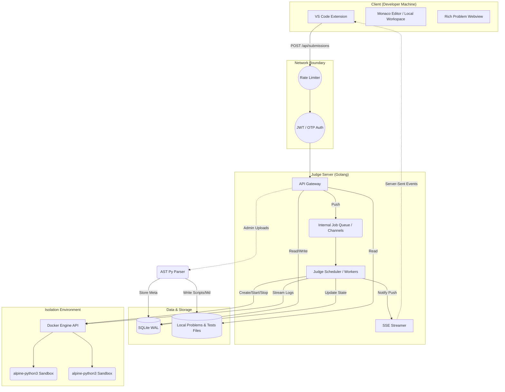

# PtLPOJ System Architecture & Design

本文档详细描述了 PtLPOJ (Ptlantern's Learning Platform Online Judge) 的系统架构、组件交互方式以及核心技术选型背后的思考。

---

## 1. 宏观架构概览 (High-Level Architecture)

PtLPOJ 采用整洁的 **Client-Server-Sandbox (C-S-S)** 三层解耦架构。其核心设计理念是**“重判题，轻前端”**与**“元数据分离”**：题目详情与脚手架代码通过 API 动态获取，而敏感的评测用例则永远保留在服务端，实现懒加载与数据的绝对安全性。

---

## 2. 核心组件详解 (Component Deep Dive)

### 2.1 客户端层：VS Code 插件 (Client Tier)
* **职责**：替代传统的 Web 浏览器前端，负责身份验证交互、题目树状导航、Markdown 富文本渲染以及代码的本地读写与提交。
* **技术选型**：`TypeScript` + `VS Code Extension API`。
* **通信与安全**：使用 `Axios` 进行可靠的 HTTP 通信。JWT Token 绝不硬编码或存放在普通配置文件中，而是利用 `context.secrets.store()` (VS Code Secrets API) 写入宿主操作系统的高级凭据管理器 (如 Windows Credential Manager, macOS Keychain)。
* **离线容忍度**：题目模板拉取到本地工作区后，断网状态下依然能够继续编写核心逻辑代码或使用本地 Python 解释器进行调试。

### 2.2 接入层：网关与中间件 (API Gateway & Middleware)
* **职责**：防刷限流与访问控制。
* **限流 (Rate Limiting)**：基于 Golang 内置的 `x/time/rate` 令牌桶算法。特别是在登录/OTP 验证节点，限制同 IP 的高频重试，防止暴力破解。
* **无密鉴权 (Passwordless Auth)**：采用基于邮箱的动态验证码 (OTP) 体系，系统验证成功后签发无状态的 JWT (JSON Web Token)，包含用户的 `UUID` 和 `Role` 声明。

### 2.3 核心业务与调度层 (Judge Server)
* **职责**：处理 RESTful 请求、维护高压判题队列、并协调底层执行器。
* **技术选型**：`Golang` 的高并发模型。
* **背压设计 (Backpressure)**：当学生短时间进行海量提交（如 100 份/秒），Server 不会立即开启 100 个沙盒压垮宿主机。提交记录落库为 `PENDING` 状态后，会压入带缓冲的 Go Channel（缓冲大小 100）。固定数量的 Judge Worker 协程通过 fan-out 模式从 channel 拉取任务，平滑削峰。
* **断电恢复 (Crash Recovery)**：系统在 Boot 引导阶段，会主动轮询 SQLite 中遗留的驻留状态为 `RUNNING` 甚至 `PENDING` 的孤儿判题，并重新推入消费队列。

### 2.4 沙盒引擎层 (Sandbox Engine)
* **职责**：提供对不受信学生代码的绝对隔离与执行计时。
* **技术选型**：`Docker Engine API SDK`，通过 Go 直接编排容器。
* **安全硬化 (Hardening Rules)**：
    * **NetworkDisabled: true**：拔除容器虚机网卡，斩断反向 Shell 和外发接口调用的可能。
    * **cgroups**：利用 Linux `cgroups` 严格划定容器内存上限 (如 256MB) 并在触发时由内核直接 `SIGKILL` (得到 OLE 评判)；设定 CPU 绝对运行周期限定 (Quota)。
    * **CapDrop ["ALL"] & User Namespace**：卸载一切 root 特权，以最低权限用户启动。
    * **CPU-Time 熔断**：TLE 判断基于容器实际消耗的 CPU 时间（`CPUStats.CPUUsage.TotalUsage`），而非墙钟时间（wall-clock time），避免容器调度延迟导致正常代码被判超时。物理超时仍由 `Context.WithTimeout` 控制（`timeLimitMs + 2000ms`），用于防止死循环或休眠。
    * **I/O 截断**：对于程序的 `stdout` 和 `stderr` 流捕获，使用 `io.LimitReader` 包裹，防止学生恶意打桩输出数百兆垃圾数据撑爆服务端内存空间。
    * **print() 静默**：在评测执行阶段替换 `builtins.print` 为静默函数，防止用户代码的输出污染 doctest 的比较输出。

### 2.5 数据存储层 (Data Layer)
* **关系数据**：采用 `SQLite` 单体数据库。利用 `GORM` 框架管理 `Users`, `Submissions`, `Problems` 等结构化状态。
    * **并发写优化**：为了避免 Go 协程并发更新判题状态遇到的 `Database is locked` 问题，初始化 DSN 时强制注入 `_journal_mode=WAL`（Write-Ahead Logging）和高容忍阈值的忙等待重试机制 `_busy_timeout=5000`。
* **非结构化文件**：题目的 Markdown 描述文本以及最为私密的隐藏验证数据（`tests.txt`），以纯文件形式存储在服务端配置目录下（如 `data/problems/1001/`）。这些文件仅在被 Worker 拉起评测时挂载或直接读入内存并注入代码流。

### 2.6 AST 动态解析中台 (AST Parser Engine)
* **职责**：为了解决传统 OJ 需要维护海量碎散文件（描述文档、测试用例档、代码桩档）的痛点。
* **实现**：采用轻量级 Python AST API 进行源代码抽象语法树解析。
* **工作流**：管理员在前端上传标准化的 `.py` 源文件，`Gateway` 接收后即交由 `parse_worker.py` 执行自动化逆向生成策略：
    1. 提取模块或顶级函数的 `docstring`，流式转换为题面 Markdown 描述。
    2. 提取内部的 `doctest` 测试断言，格式转换后生成沙盒隐藏测试用例 `tests.txt`。
    3. 移除函数实现主体并保留方法签名（将内容置换为 `pass` 等占位符），生成下发至学生端运行的代码脚手架。
    4. 执行数据库插入动作录入系统并提供热刷新。

---

## 3. 核心设计妥协与思考 (Design Trade-offs)

1. **为什么用 SQLite 而不是 MySQL/PostgreSQL？**
   本系统的首要目标是“极简部署”，特别针对中小规模班级教学场景或内部小团队（<200 人）。SQLite 的 WAL 模式已经能够完美承载轻量级的高并发写请求，免去了运维数据库集群的心智负担。
2. **为什么彻底抛弃 Web 前端？**
   为了保证开发“沉浸流”。在 Web 浏览器上写算法题总是面临没有智能提示（IntelliSense）、无法引入第三方包在本地做验证的问题。在 VS Code 侧完成闭环是下一代开发者工具的标准。
3. **为什么使用 SSE 代替 WebSocket？**
   对于判题结果推流，需求是 **单向的服务器至客户端通知**（仅仅告诉客户端判题的阶段性进度）。`Server-Sent Events (SSE)` 架构比 WebSocket 更轻量、占用连接资源更少，天生支持断线重连标准，特别切合该场景。

## 4. 容器化探索记录

本项目曾探索通过 `docker-compose` 实现一键部署，主要目标是安全地隔离沙箱执行（避免 `/var/run/docker.sock` 挂载带来的容器逃逸和权限提升风险）。遇到的核心困难如下：

**沙箱与 docker.sock 的根本矛盾**：沙箱执行需要创建新的 Docker 容器，创建容器必须通过 Docker daemon（通过 unix socket `/var/run/docker.sock` 或 TCP 接口）。挂载 docker.sock 到任何容器都意味着该容器内的进程等价于拥有宿主机 root 权限——一旦被攻破（如代码注入、远程代码执行），攻击者可以直接在宿主机上创建特权容器、挂载目录或执行任意命令，完全控制宿主机。业界对此没有完美的"无需 docker.sock 就能创建容器"的解决方案。

**Sysbox 安全方案**：理论上，Sysbox 运行时可以创建隔离的 mini-VM 环境，结合 User Namespace remapping（容器内 root 映射到宿主机普通用户）和合理的 Resource Quota，能够大幅降低 docker.sock 挂载的风险——即使容器被攻破，逃逸也受限于 Sysbox 创建的隔离层。但在 WSL2 + Docker Desktop 环境下，Docker Desktop 的 dockerd 运行在独立的 Linux VM 中，不受宿主机的 `/etc/docker/daemon.json` 控制，因此无法配置 sysbox 运行时。对于原生 Linux + Docker 环境，Sysbox 方案是可行的，只需在宿主机安装 sysbox 并在 `docker-compose.yml` 中指定 `runtime: sysbox-runc` 即可。

**结论**：在当前 WSL2 开发环境约束下，最务实的选择是保持宿主机裸机部署架构——Go 服务直接运行在宿主机上，通过 docker socket 创建沙箱容器。教学场景下（非对抗性环境），现有的安全限制（User Namespace、CapDrop、cgroups、NetworkDisabled 等）已提供足够的隔离保护。容器化部署作为未来规模化部署的优化方向，需在原生 Linux 环境中配合 sysbox 才能安全落地。
