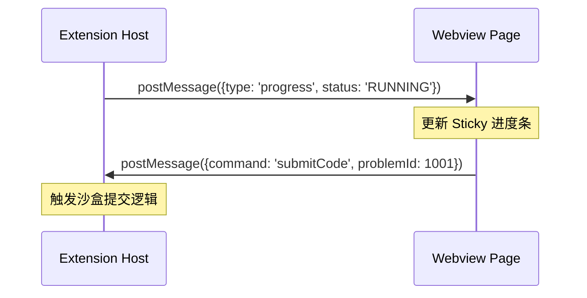

# 技术规范：Webview 架构与交互设计 (UIUX_WEBVIEW_SPEC)

## 1. 概述
PtLPOJ 插件使用 VS Code Webview API 来承载题目内容（ProblemView）与统计仪表盘（DashboardView）。本规范定义了渲染流程、通讯协议以及样式适配标准。

## 2. 渲染架构

### 2.1 题目渲染引擎
- **核心组件**：`markdown-it` (GfM 兼容)
- **数学公式**：集成 `markdown-it-katex`，支持 `$` (内联) 与 `$$` (块级) 语法。
- **资源管理**：所有第三方库（KaTeX CSS 等）必须通过 `webview.asWebviewUri` 转换后加载，以符合 VS Code 的内容安全策略（CSP）。

### 2.2 通讯总线逻辑
插件主体（Extension Host）与 Webview 页面之间通过 `.postMessage()` 进行异步双向通讯。

## 3. 交互标准

### 3.1 进度感知 (Feedback)
- **Sticky Header**：评测状态栏必须在页面顶部保持固定（Sticky），防止用户滚动描述文本时丢失反馈。
- **动态样式**：
  - `AC`: 背景色切换至 `testing.iconPassed` 对应颜色。
  - `WA/ERROR`: 切换至 `testing.iconFailed` 对应颜色。

### 3.2 布局一致性
- **Split View**：题面展示必须强制锁定在 `ViewColumn.Two`，代码编辑区锁定在 `ViewColumn.One`。

## 4. 视觉规范 (Theme Adaptation)
禁止使用硬编码颜色值。必须使用 VS Code 暴露的 CSS 全局变量，以确保三类主题（Light / Dark / High Contrast）下的可用性：

| 元素 | VS Code 变量引用 |
| :--- | :--- |
| **页面主体背景** | `var(--vscode-editor-background)` |
| **标准文字颜色** | `var(--vscode-editor-foreground)` |
| **主按钮背景** | `var(--vscode-button-background)` |
| **边框颜色** | `var(--vscode-widget-border)` |
| **代码块背景** | `var(--vscode-textCodeBlock-background)` |
